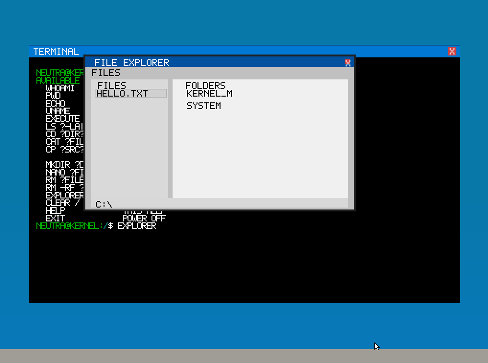

# Neutra OS

A minimal 32-bit x86 operating system with GRUB bootloader. (soon maybe 64 bit)

## Quick Start

### Running the OS

```bash
make clean
make run-iso
```
or with windows qemu

```bash
make clean
make run-win
```

## Creating Custom DCE Programs

DCE (Declarative Code Expression) is a lightweight assembly-like language for Neutra OS.

### Example DCE Program

```asm
.header
    var mode = 0x43444501
    
.section code_
code_top:
    print "Hello World!" -n
code_bottom:

halt
```

The DCE syntax is similar to assembly but with a lighter, more declarative approach.

## Compiling DCE to CDE(Compiled Dynamic Executable (soon counting as dynamic))

### Prerequisites
- Ensure you're in the project root directory

### Compilation Steps

1. **Compile DCE program to CDE:**
   ```bash
   python compiler.py program.dce program.cde
   ```

2. **Move the compiled file:**
   ```bash
   cp program.cde src/kernel/kernel_memory/
   ```

3. **Generate C header file:**
   ```bash
   cd src/kernel/kernel_memory
   xxd program.cde program.h
   ```

4. **Execute in shell:**
   ```bash
   execute
   ```
## There is a new file explorer to create files and folders
you can add folders or files and navigate with W A S D

and close the Explorer with the mouse ( ps2 mouse)
and id recommand if you close it to drag the Terminal over the File Explorer 
in case of pixels that dident cleared

## Keyboard layout
the layout is QWERTZ 
and will be changed soon to support both QWERTZ and QWERTY

## Neutra Ver 0.4 

## Neutra Ver 0.8


